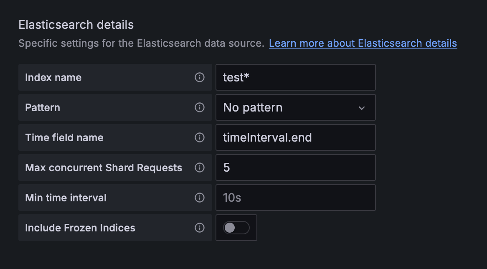

# Clockbridge

Clockbridge is an application that listens for a Clockify webhook, validates the signature and payload, then pushes to a configurable Elasticsearch instance. It uses Flask for the listener, Gunicorn as the production web server, and is packaged as a Docker container. It's mainly intended for me to track time spent on my hobbies at home and as an ongoing DevOps project.

This application is automatically built, tested, and deployed by Gitlab CI/CD on my local infrastructure. My Elasticsearch cluster is hosted on Elastic Cloud on Kubernetes (ECK) on my local cluster (built using Kubeadm). It's backed by external NFS storage.

## Usage

```python
python app.py
```

## Sample Configuration
```yaml
webhook_secrets:
- xxxxxxxxxxxxxxxxxxxxxxxxxxxxxxxx  # Secrets that will be validated in the headers
- yyyyyyyyyyyyyyyyyyyyyyyyyyyyyyyy
event_types:                        # Event types to listen for and run on
- new_time_entry
- timer_stopped
- time_entry_UPDATED
- time_entry_deleted
elastic_creds:
  url: https://test.com:9200
  insecure: true                    # SSL certificate verification
  username: test
  password: dGVzdDEyMwo=           # Password must be Base64 encoded
  index_prefix: test               # Index will be labelled <index-prefix>-<YY-MM>
log_level: DEBUG                   # Logging level, options are DEBUG/INFO/WARNING/ERROR/CRITICAL
```

## Screenshots

